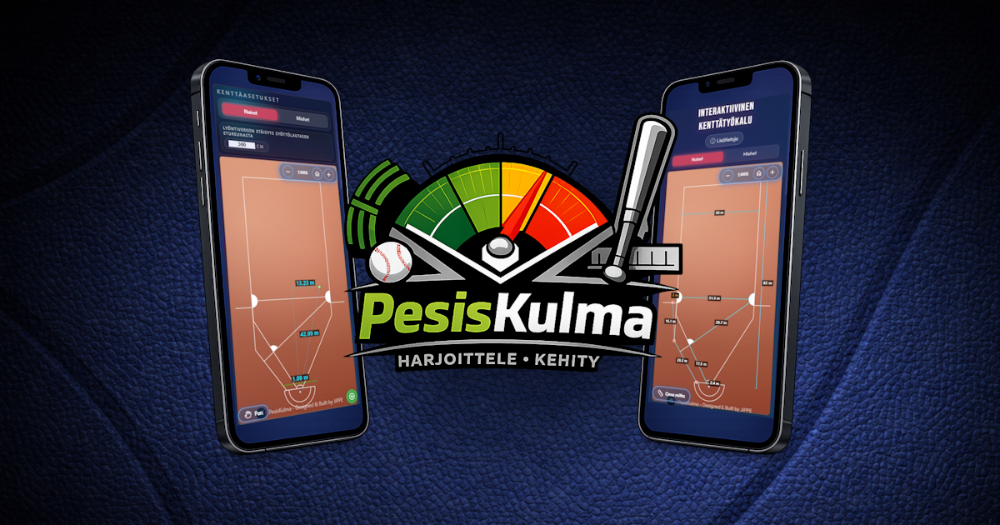

# PesisKulma

## Yhteenveto

PesisKulma on selainpohjainen työkalupaketti pesäpallon lyöntiharjoitteluun ja kenttämittausten analysointiin. Sovellus koostuu kahdesta päätoiminnosta:

**PesisKulma** - Lyöntiharjoittelun suunnittelutyökalu verkkoon tai pressuun lyömistä varten. Visualisoi lyöntikulmia, mittaa etäisyyksiä syöttölautaselta ja auttaa hahmottamaan lyöntisuuntia kentällä.

**PesisKenttä** - Interaktiivinen kenttäkartta, jolla voit vertailla eri kenttäprofiileja (naiset/miehet), piirtää omia mittalinjoja ja mitata juoksu- tai heittoetäisyyksiä suoraan kentällä. Täsmällinen työkalu kentän analysointiin.

## Ominaisuudet

### Yleiset ominaisuudet

- 🌍 **Monikielisyys**: Käyttöliittymä suomeksi, englanniksi ja ruotsiksi
- 📏 **Yksikkömuunnokset**: Vaihda metrisen (cm/m) ja brittiläisen (tuumat/jalat) järjestelmän välillä
- 📱 **Responsiivinen**: Täysin optimoitu mobiili- ja työpöytäkäyttöön

### PesisKulma - Lyöntiharjoittelutyökalu

- Miesten ja naisten kenttäprofiilit
- Lyöntiverkon etäisyyden määrittely (mukautettava)
- Syöttölautasen pallon sijainnin säätö (interaktiivinen lautanen)
- Reaaliaikaiset mittaukset:
  - Etäisyys keskiviivasta osumakohtaan verkossa
  - Kokonaisetäisyys syöttölautaselta kohteeseen
  - Sivuttaisetäisyys keskiviivasta
- Zoom- ja pan-toiminnot tarkempaa tarkastelua varten

### PesisKenttä - Kenttäkartta ja mittaustyökalu

- Kenttäprofiilien vertailu (naiset/miehet)
- Kaikki keskeiset kenttämitat näkyvissä:
  - Ykkösväli, kakkosväli, kolmosväli
  - Kotipolku (diagonaali)
  - Kentän pituus ja leveys
- **Oma mitta -toiminto**: Piirrä vapaasti mittalinjoja kentällä ja mittaa etäisyyksiä
- Muokattavat kenttäpisteet kotipolulla: Sijainteja ja tarkastele vaikutuksia mittauksiin
- Zoom/pan/reset -työkalut navigointiin
- Tooltip-näyttö mittausten helpottamiseksi

## Käyttö

### PesisKulma

1. Valitse kenttäprofiili (Naiset/Miehet)
2. Syötä lyöntiverkon etäisyys syöttölautasen etureunasta (oletuksena cm, mutta muunnettavissa tuumiin)
3. Säädä pallon sijaintia syöttölautasella interaktiivisella lautasella tai mobiilissa avautuvalla modaalilla
4. Tarkastele reaaliaikaisia mittauksia verkossa ja sivusuunnassa

### PesisKenttä

1. Valitse kenttäprofiili (Naiset/Miehet)
2. Käytä zoom-työkaluja lähentääksesi tai loitontaaksesi näkymää
3. Aktivoi "Oma mitta" -toiminto piirtääksesi mittalinjoja kentälle. Mittalinjoja voi yhdistää kokonaismittauksen helpottamiseksi.
4. Klikkaa ja vedä piirtääksesi mittauslinja - etäisyys näkyy automaattisesti
5. Tarkastele kenttämittoja mittaustyökaluilla

### Yleiset toiminnot

- **Kielivalinta**: Vaihda kieltä yläkulman 🌐-painikkeesta (FI/EN/SV)
- **Yksikkövalinta**: Vaihda mittayksikköä 📐-painikkeesta (metrinen/brittiläinen)
- Sovellus toimii ilman palvelinyhteyttä - avaa selaimessa suoraan `index.html`

---

## Overview (English)

PesisKulma is a browser-based toolkit for Finnish baseball hitting training and field measurement analysis. The application consists of two main tools:

**PesisKulma** - A hitting practice planning tool for net or tarp sessions. Visualizes hitting angles, measures distances from the pitching plate, and helps understand hitting directions on the field.

**PesisKenttä** - An interactive field map that allows you to compare different field profiles (women/men), draw custom measurement lines, and measure running or throwing distances directly on the field. A precise tool for field analysis.

### Features

**General Features**

- 🌍 **Multilingual**: User interface in Finnish, English, and Swedish
- 📏 **Unit Conversion**: Switch between metric (cm/m) and imperial (inches/feet) systems
- 📱 **Responsive**: Fully optimized for mobile and desktop use

**PesisKulma - Hitting Practice Tool**

- Women's and men's field profiles
- Customizable net distance configuration
- Pitching plate ball position adjustment (interactive plate)
- Real-time measurements:
  - Distance from center line to net impact point
  - Total distance from pitching plate to target
  - Lateral distance from center line
- Zoom and pan functions for detailed viewing

**PesisKenttä - Field Map and Measurement Tool**

- Field profile comparison (women/men)
- All key field measurements visible:
  - First base distance, second base distance, third base distance
  - Home path (diagonal)
  - Field length and width
- **Custom Measurement Tool**: Draw measurement lines freely on the field and measure distances
- Editable field points on home path: Adjust positions and examine effects on measurements
- Zoom/pan/reset tools for navigation
- Tooltip display to facilitate measurements

### Usage

**PesisKulma**

1. Select field profile (Women/Men)
2. Enter net distance from front edge of pitching plate (default in cm, but convertible to inches)
3. Adjust ball position on pitching plate using interactive plate or modal that opens on mobile
4. View real-time measurements to the net and lateral distances

**PesisKenttä**

1. Select field profile (Women/Men)
2. Use zoom tools to zoom in or out of the view
3. Activate "Custom Measurement" function to draw measurement lines on the field. Measurement lines can be connected to facilitate total measurements.
4. Click and drag to draw a measurement line - distance is displayed automatically
5. View field measurements with measurement tools

**General Functions**

- **Language Selection**: Change language from the 🌐 button in the upper corner (FI/EN/SV)
- **Unit Selection**: Change measurement unit from the 📐 button (metric/imperial)
- Application works without server connection - open `index.html` directly in browser

---

License: [MIT](LICENSE)
